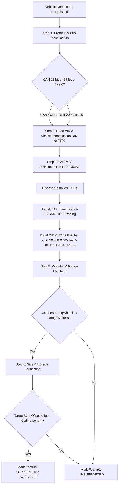

# Feature Applicability Engine Specification

## 1. Executive Summary
This document defines how the Carista diagnostic engine determines whether a specific customization, service tool, or diagnostic feature is available on a connected vehicle.

---

## 2. Applicability Decision Tree (Step-by-Step)

---

## 3. The 6 Layers of Applicability Verification

### Layer 1: Protocol & Bus Matching
- **VAG CAN 11-bit**: ISO 15765-4 (500 kbps). ECUs use standard pairs (`0x7E0/0x7E8`, `0x713/0x77D`, `0x70E/0x778`, `0x752/0x7BC`).
- **VAG CAN 29-bit**: Extended addressing where $Rx = Tx + 0x00020000$ (e.g. Engine `0x17FC0076` $	o$ `0x17FE0076`).
- **KWP2000 TP2.0**: Setup CAN ID = $0x200 + LogicalAddress$. Communication uses dynamic setup channels (`1A 9F`).

### Layer 2: Installed ECU Discovery
- Carista queries **CAN Gateway (0x19)** using Data Identifier **`0x04A1`** (`22 04 A1`).
- The response contains consecutive 4-byte records. Byte 0 is the ECU logical address (e.g. `0x01` Engine, `0x03` ABS, `0x09` BCM, `0x17` Cluster, `0x53` EPB).
- If an ECU is not reported in DID `0x04A1`, all features belonging to that ECU are immediately marked `UNSUPPORTED`.

### Layer 3: ASAM / ODX Project Identifier Matching
- On MQB, MLBevo, and modern UDS platforms, Carista reads the 2-D ASAM dataset identifier (`EV_*`) from the ECU.
- Examples discovered in `libCarista.so.c`:
  - `EV_BodyContrModul1UDSCont_015`
  - `EV_BCM1BOSCHAU651_011`
  - `EV_DashBoardVDD_001`
- Carista matches the exact ASAM version string against compiled `VagUdsFreezeFrameSettings` and `AsamBasedSetting` tables.

### Layer 4: StringWhitelist & RangeWhitelist Matching
- Each `Setting` instance has an associated `shared_ptr<StringWhitelist>` or `shared_ptr<RangeWhitelist>`.
- `StringWhitelist` contains a list of supported ECU Part Numbers (DID `0xF187`, e.g. `5Q0937084`, `1K0920874A`) or SW Versions (DID `0xF189`).
- `RangeWhitelist` defines valid software revision ranges (`min_sw <= current_sw <= max_sw`).

### Layer 5: Dynamic Coding Buffer Bounds Check
- In `CheckSettingsOperation::run()`:
  - Carista reads the current full coding buffer (e.g. 30 bytes for MQB BCM, 47 bytes for MLBevo BCM).
  - It verifies: `setting.byteOffset < codingBuffer.size()`.
  - If a vehicle has a low-line ECU with only 20 bytes of coding, and a feature resides in Byte 26, it is automatically marked `UNSUPPORTED` to prevent out-of-bounds writes.

### Layer 6: SecurityAccess & SFD Verification
- If a channel requires Security Access (`SecurityType::LOGIN`), Carista tests whether the ECU accepts the standard login seed-key.
- On MQB2020+ models (Golf 8, Octavia 4, Audi A3 8Y), protected ECUs return NRC `0x33 SecurityAccessDenied` due to SFD (Schutz Fahrzeug Diagnose). If an SFD offline/online token is absent, Carista displays a security lock badge (`LockingSettingActivity`).
