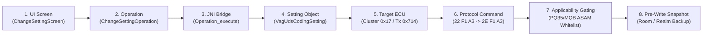

# Molecular Feature Dependency Graph

Total Features Traced End-to-End: **478** (Ready: **314**, Blocked: **164**)  

## 1. End-to-End Trace Architecture

## 2. Representative End-to-End Traces

### `FEAT_0227_INSTR_NEEDLE_SWEEP`: Gauge needle sweep at startup

- **UI Screen**: `ChangeSettingScreen` (`com.prizmos.carista.screens.operation.changesetting.ChangeSettingActivity`)
- **Operation Class**: `com.prizmos.carista.library.operation.ChangeSettingOperation`
- **JNI Bridge**: `Java_com_prizmos_carista_library_operation_Operation_execute`
- **Native Function**: `Setting::setValue`
- **Setting / Tool Object**: `VagUdsCodingSetting` (`car_setting_instr_needle_sweep`)
- **Target ECU**: `INSTRUMENT_CLUSTER (0x17)` | Tx: `0x714`, Rx: `0x77E`
- **Protocol**: `UDS (ISO 14229)`
- **Commands**: Read `22F1A3`, Write `2EF1A3` (Byte: `1`, Mask: `0x10`)
- **Applicability Gating**: Platforms: `PQ35, MQB, MLB`, Gate: `0x17 present in Gateway 0x19 list`
- **Persistence Dependency**: `ChangedSettingEvent pre-write snapshot in Realm/Room SQLite`
- **Network Dependency**: `None (100% Offline Capable)`

---

### `DIAG_AUTOSCAN`: Full Diagnostic Scan (AutoScan)

- **UI Screen**: `AutoScanScreen` (`com.prizmos.carista.screens.operation.fullscan.FullScanActivity`)
- **Operation Class**: `com.prizmos.carista.library.operation.FullScanOperation`
- **JNI Bridge**: `Java_com_prizmos_carista_library_operation_FullScanOperation_00024RichState_make`
- **Native Function**: `GetVagUdsInstalledEcusCommand::processPayload`
- **Setting / Tool Object**: `UNRESOLVED` (`autoscan_full_gateway_discovery`)
- **Target ECU**: `UNKNOWN (0x09)` | Tx: ``, Rx: ``
- **Protocol**: `UDS`
- **Persistence Dependency**: `None`
- **Network Dependency**: `None`

---

### `DIAG_CLEAR_DTC`: Clear Fault Codes (DTC Reset)

- **UI Screen**: `DtcDiagnosticsScreen` (`com.prizmos.carista.screens.operation.checkcodes.CheckCodesActivity`)
- **Operation Class**: `com.prizmos.carista.library.operation.ResetCodesOperation`
- **JNI Bridge**: `Java_com_prizmos_carista_library_operation_Operation_execute`
- **Native Function**: `ClearAllDtcsCommand::getRequest`
- **Setting / Tool Object**: `UNRESOLVED` (`clear_fault_codes_all_groups`)
- **Target ECU**: `UNKNOWN (0x09)` | Tx: ``, Rx: ``
- **Protocol**: `UDS`
- **Persistence Dependency**: `None`
- **Network Dependency**: `None`

---

### `TOOL_EPB_SERVICE`: Electronic Parking Brake (EPB) Retract / Close

- **UI Screen**: `GenericServiceToolRunnerScreen` (`com.prizmos.carista.GenericToolActivity`)
- **Operation Class**: `com.prizmos.carista.library.operation.GenericToolOperation`
- **JNI Bridge**: `Java_com_prizmos_carista_library_operation_GenericToolOperation_onButtonClickedInternal`
- **Native Function**: `VagEpbController::executeOpen`
- **Setting / Tool Object**: `UNRESOLVED` (`epb_electronic_parking_brake_service`)
- **Target ECU**: `UNKNOWN (0x09)` | Tx: ``, Rx: ``
- **Protocol**: `UDS`
- **Persistence Dependency**: `None`
- **Network Dependency**: `None`

---

### `TOOL_DPF_REGENERATION`: DPF Regeneration (Service / Emergency)

- **UI Screen**: `GenericServiceToolRunnerScreen` (`com.prizmos.carista.GenericToolActivity`)
- **Operation Class**: `com.prizmos.carista.library.operation.GenericToolOperation`
- **JNI Bridge**: `Java_com_prizmos_carista_library_operation_GenericToolOperation_onButtonClickedInternal`
- **Native Function**: `VagDpfController::startStationary`
- **Setting / Tool Object**: `UNRESOLVED` (`dpf_diesel_particulate_filter_regeneration`)
- **Target ECU**: `UNKNOWN (0x09)` | Tx: ``, Rx: ``
- **Protocol**: `UDS`
- **Persistence Dependency**: `None`
- **Network Dependency**: `None`

---

### `TOOL_BATTERY_REGISTRATION`: Battery Registration (New Battery Coding)

- **UI Screen**: `GenericServiceToolRunnerScreen` (`com.prizmos.carista.GenericToolActivity`)
- **Operation Class**: `com.prizmos.carista.library.operation.GenericToolOperation`
- **JNI Bridge**: `Java_com_prizmos_carista_library_operation_Operation_execute`
- **Native Function**: `VagBatteryRegController::executeWrite`
- **Setting / Tool Object**: `UNRESOLVED` (`battery_registration_adaptation`)
- **Target ECU**: `UNKNOWN (0x09)` | Tx: ``, Rx: ``
- **Protocol**: `UDS`
- **Persistence Dependency**: `None`
- **Network Dependency**: `None`

---

### `TOOL_SERVICE_RESET`: Service Indicator Reset (Oil & Inspection)

- **UI Screen**: `GenericServiceToolRunnerScreen` (`com.prizmos.carista.GenericToolActivity`)
- **Operation Class**: `com.prizmos.carista.library.operation.ServiceIndicatorOperation`
- **JNI Bridge**: `Java_com_prizmos_carista_library_operation_ServiceIndicatorOperation_00024RichState_make`
- **Native Function**: `VagServiceIndicatorController::executeReset`
- **Setting / Tool Object**: `UNRESOLVED` (`service_indicator_wiv_reset`)
- **Target ECU**: `UNKNOWN (0x09)` | Tx: ``, Rx: ``
- **Protocol**: `UDS`
- **Persistence Dependency**: `None`
- **Network Dependency**: `None`

---

