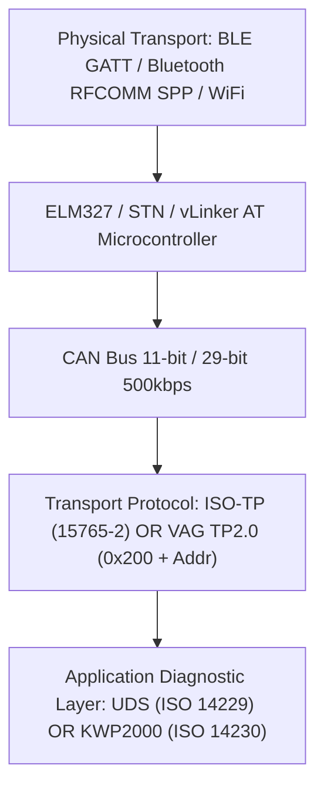

# Molecular Transport Stack & State Machines

Full clean-room decomposition of all vehicle communication layers from physical adapter down to diagnostic application payloads.

## 1. Protocol Stack Hierarchy



## Bluetooth Low Energy (GATT)

- Machine-Readable Spec: `research/molecular/transport_state_machines/ble_state_machine.json`

```json
{
  "protocol": "Bluetooth Low Energy (GATT)",
  "service_uuids": [
    "0000fff0-0000-1000-8000-00805f9b34fb",
    "000018f0-0000-1000-8000-00805f9b34fb",
    "6e400001-b5a3-f393-e0a9-e50e24dcca9e"
  ],
  "characteristic_tx": "0000fff2-0000-1000-8000-00805f9b34fb",
  "characteristic_rx": "0000fff1-0000-1000-8000-00805f9b34fb",
  "cccd_uuid": "00002902-0000-1000-8000-00805f9b34fb",
  "mtu_negotiation": "Request MTU 247 or 512, fallback to 23",
  "states": [
    "DISCONNECTED",
    "SCANNING",
    "CONNECTING_GATT",
    "DISCOVERING_SERVICES",
    "ENABLING_NOTIFICATIONS",
    "READY",
    "ERROR",
    "RECONNECTING"
  ],
  "timings": {
    "connection_timeout_ms": 10000,
    "notification_enable_timeout_ms": 3000,
    "write_timeout_ms": 2000,
    "reconnect_backoff_ms": [
      500,
      1000,
      2000,
      5000
    ]
  },
  "error_recovery": "GATT 133 error triggers gatt.close(), sleep 500ms, and retry fresh connection up to 3 times."
}
```

## Bluetooth Classic RFCOMM (SPP)

- Machine-Readable Spec: `research/molecular/transport_state_machines/rfcomm_spp_state_machine.json`

```json
{
  "protocol": "Bluetooth Classic RFCOMM (SPP)",
  "spp_uuid": "00001101-0000-1000-8000-00805F9B34FB",
  "states": [
    "DISCONNECTED",
    "DISCOVERY",
    "CONNECTING_SOCKET",
    "STREAM_OPEN",
    "READY",
    "SOCKET_CLOSED",
    "RECONNECTING"
  ],
  "buffer_size": 2048,
  "timings": {
    "socket_connect_timeout_ms": 8000,
    "read_timeout_ms": 3000,
    "keepalive_interval_ms": 5000
  },
  "error_recovery": "IOException on stream triggers socket.close(), reflection fallback (createRfcommSocketToServiceRecord vs createInsecureRfcommSocket), sleep 1000ms."
}
```

## ELM327 / STN / vLinker AT Interpreter

- Machine-Readable Spec: `research/molecular/transport_state_machines/elm327_stn_state_machine.json`

```json
{
  "protocol": "ELM327 / STN / vLinker AT Interpreter",
  "prompt_char": ">",
  "command_delimiter": "\\r",
  "init_sequence": [
    {
      "cmd": "AT Z",
      "expect": "ELM327",
      "desc": "Reset microcontroller"
    },
    {
      "cmd": "AT E0",
      "expect": "OK",
      "desc": "Echo off"
    },
    {
      "cmd": "AT L0",
      "expect": "OK",
      "desc": "Linefeeds off"
    },
    {
      "cmd": "AT S0",
      "expect": "OK",
      "desc": "Spaces off"
    },
    {
      "cmd": "AT H1",
      "expect": "OK",
      "desc": "Headers on (preserve CAN IDs)"
    },
    {
      "cmd": "AT AT 1",
      "expect": "OK",
      "desc": "Adaptive timing auto"
    },
    {
      "cmd": "AT ST 32",
      "expect": "OK",
      "desc": "Set timeout to 200ms (32 * 4ms)"
    },
    {
      "cmd": "AT SP 6",
      "expect": "OK",
      "desc": "Select ISO 15765-4 11-bit 500k CAN"
    }
  ],
  "stn_extensions": [
    {
      "cmd": "STP 33",
      "desc": "STN protocol selection for TP2.0"
    },
    {
      "cmd": "STPX",
      "desc": "STN ISO-TP multi-frame transmit"
    }
  ],
  "error_responses": [
    "NO DATA",
    "CAN ERROR",
    "BUS BUSY",
    "FB ERROR",
    "BUFFER FULL",
    "ERR12",
    "?"
  ],
  "error_handling": "Buffer clear by sending empty \\r, re-send AT Z if 3 consecutive unrecognized responses occur."
}
```

## CAN 11-bit and 29-bit Addressing Rules

- Machine-Readable Spec: `research/molecular/transport_state_machines/can_addressing_state_machine.json`

```json
{
  "protocol": "CAN 11-bit and 29-bit Addressing Rules",
  "can_11bit_vag": {
    "formula": "if (TX >= 0x795) RX = TX + 8 else RX = TX + 0x6A",
    "evidence": "libCarista.so.c line 584009-584012 (VagUdsEcu constructor)",
    "examples": [
      {
        "ecu": "ENGINE",
        "tx": "0x7E0",
        "rx": "0x7E8"
      },
      {
        "ecu": "TRANSMISSION",
        "tx": "0x7E1",
        "rx": "0x7E9"
      },
      {
        "ecu": "CENTRAL_ELEC (0x09)",
        "tx": "0x70E",
        "rx": "0x778"
      },
      {
        "ecu": "CAN_GATEWAY (0x19)",
        "tx": "0x710",
        "rx": "0x77A"
      },
      {
        "ecu": "ABS (0x03)",
        "tx": "0x713",
        "rx": "0x77D"
      },
      {
        "ecu": "CLUSTER (0x17)",
        "tx": "0x714",
        "rx": "0x77E"
      },
      {
        "ecu": "EPB (0x53)",
        "tx": "0x752",
        "rx": "0x7BC"
      }
    ]
  },
  "can_29bit_vag": {
    "formula": "RX = TX + 0x00020000",
    "evidence": "libCarista.so.c line 583921",
    "examples": [
      {
        "ecu": "ENGINE",
        "tx": "0x17FC0076",
        "rx": "0x17FE0076"
      },
      {
        "ecu": "TRANSMISSION",
        "tx": "0x17FC0077",
        "rx": "0x17FE0077"
      }
    ]
  }
}
```

## ISO 15765-2 Transport Layer

- Machine-Readable Spec: `research/molecular/transport_state_machines/iso_tp_state_machine.json`

```json
{
  "protocol": "ISO 15765-2 Transport Layer",
  "frame_types": {
    "0x0": "Single Frame (SF): Data length 1-7 bytes [0x0L data...]",
    "0x1": "First Frame (FF): Total length 8-4095 bytes [0x1L LL data...]",
    "0x2": "Consecutive Frame (CF): Sequence number 0-F [0x2S data...]",
    "0x3": "Flow Control (FC): FlowStatus [0x30 BS STmin]"
  },
  "flow_control_parameters": {
    "block_size_bs": 0,
    "st_min_ms": 0,
    "fc_wait_count_max": 10
  },
  "timings": {
    "n_ar_max_ms": 1000,
    "n_as_max_ms": 1000,
    "n_cr_max_ms": 1000,
    "n_bs_max_ms": 1000
  },
  "reassembly_rules": "On FF received, immediately transmit FC frame (30 00 00), allocate payload buffer, expect sequential CFs until expected bytes received."
}
```

## Volkswagen TP2.0 (Transport Protocol 2.0)

- Machine-Readable Spec: `research/molecular/transport_state_machines/tp20_state_machine.json`

```json
{
  "protocol": "Volkswagen TP2.0 (Transport Protocol 2.0)",
  "channel_setup": {
    "formula": "CAN ID = 0x200 + LogicalAddress",
    "setup_request": "01 C0 00 10 00 03 01",
    "evidence": "libCarista.so.c line 455618 (VagCanEcu::initialize)"
  },
  "data_framing": {
    "control_bytes": {
      "0x10": "Data packet without ACK request",
      "0x20": "Data packet with ACK request",
      "0xB0": "ACK response packet",
      "0xA0": "Keepalive request",
      "0xA1": "Keepalive response",
      "0xD8": "Channel teardown / disconnect"
    }
  },
  "timings": {
    "channel_setup_timeout_ms": 2000,
    "ack_timeout_ms": 500,
    "keepalive_interval_ms": 1000
  }
}
```

## ISO 14229-1 (UDS over ISO-TP)

- Machine-Readable Spec: `research/molecular/transport_state_machines/uds_state_machine.json`

```json
{
  "protocol": "ISO 14229-1 (UDS over ISO-TP)",
  "services": {
    "0x10": "DiagnosticSessionControl (0x01 Default, 0x02 Programming, 0x03 Extended)",
    "0x11": "ECUReset (0x01 Hard, 0x03 Soft)",
    "0x14": "ClearDiagnosticInformation (14 FF FF FF)",
    "0x19": "ReadDTCInformation (19 02 8D)",
    "0x22": "ReadDataByIdentifier (22 DID_HI DID_LO)",
    "0x27": "SecurityAccess (27 01 / 27 02)",
    "0x2E": "WriteDataByIdentifier (2E DID_HI DID_LO Payload...)",
    "0x31": "RoutineControl (31 01 Start, 31 02 Stop, 31 03 RequestResults)",
    "0x3E": "TesterPresent (3E 00 / 3E 80 suppressPosRspMsgIndicationBit)"
  },
  "nrc_handling": {
    "0x78": {
      "name": "requestCorrectlyReceived-ResponsePending",
      "action": "WAIT and do not resend request; restart timer up to 5000ms."
    },
    "0x22": {
      "name": "conditionsNotCorrect",
      "action": "Abort write; warn user that engine must be OFF or vehicle stationary."
    },
    "0x31": {
      "name": "requestOutOfRange",
      "action": "Abort write; parameter value outside valid ECU boundaries."
    },
    "0x33": {
      "name": "securityAccessDenied",
      "action": "Abort write; Login/SFD token required."
    }
  }
}
```

## ISO 14230 / KWP2000 over TP2.0 and K-Line

- Machine-Readable Spec: `research/molecular/transport_state_machines/kwp2000_state_machine.json`

```json
{
  "protocol": "ISO 14230 / KWP2000 over TP2.0 and K-Line",
  "header_format": "[Fmt] [Tgt] [Src] [Len] [SID] [Data...]",
  "services": {
    "0x10": "StartDiagnosticSession",
    "0x14": "ClearDiagnosticInformation",
    "0x18": "ReadDiagnosticTroubleCodesByStatus (18 02 FF 00)",
    "0x1A": "ReadEcuIdentification (1A 9F - Gateway list)",
    "0x21": "ReadDataByLocalIdentifier / Adaptation Channel Read",
    "0x27": "SecurityAccess",
    "0x30": "StartRoutineByLocalIdentifier",
    "0x3B": "WriteDataByLocalIdentifier / Adaptation Channel Write"
  }
}
```

