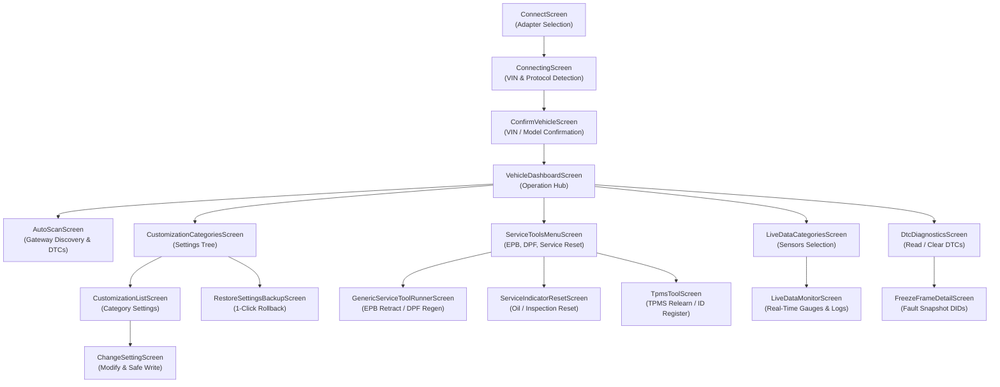

# Molecular UI / Product Screen Graph

Total Functional Screens Documented: **21**  
This document provides the end-to-end screen navigation, operations invoked, data dependencies, and safety gates reconstructed directly from `classes2.dex` and `libCarista.so.c`.

## 1. High-Level Flow Chart

## 2. Screen Specifications & Safety Invariants

### `ConnectScreen` (`com.prizmos.carista.ConnectActivity`)

- **Category**: `Connection / Transport`
- **Purpose**: Primary adapter discovery and pairing screen. Allows user to select adapter type (Carista EVO, Carista OBD, Generic ELM327 Bluetooth/BLE, WiFi) and initiate transport handshake.
- **Entry Points**: `Application Launch (MainActivity)`, `Disconnect Event`, `Toolbar Disconnect Action`
- **Outgoing Navigation**: `com.prizmos.carista.connect.ConnectToVehicleActivity`, `com.prizmos.carista.screens.connectinstructions.ConnectInstructionsActivity`, `com.prizmos.carista.screens.devicedefective.DeviceDefectiveActivity`
- **Data Dependencies**: BluetoothAdapter state, Location/Bluetooth permissions, Saved adapter MAC / UUID
- **Operation Invoked**: `Connector::connect() -> Elm::initialize()`
- **ECU / Feature Relation**: `All ECUs (Transport layer prerequisite)`
- **User Inputs**: Adapter Type Selector, Bluetooth Device List item click, Refresh Scan button, Help link
- **Safety Gates & Confirmation**: Bluetooth Enabled check, Location/Nearby Devices permission granted, Adapter ELM327 response verification
- **Result / Error States**: `Connected`, `AdapterNotFound`, `BluetoothDisabled`, `DefectiveElmClone`, `ConnectionTimeout`

---

### `VehicleConnectingProgressScreen` (`com.prizmos.carista.connect.ConnectToVehicleActivity`)

- **Category**: `Connection / Transport`
- **Purpose**: Displays connection progress state machine while querying adapter capabilities, testing CAN baudrates, reading VIN, and identifying vehicle platform.
- **Entry Points**: `com.prizmos.carista.ConnectActivity`
- **Outgoing Navigation**: `com.prizmos.carista.ConfirmVehicleActivity`, `com.prizmos.carista.SelectVehicleActivity`, `com.prizmos.carista.screens.operation.main.MainActivity`
- **Data Dependencies**: Active RFCOMM/BLE socket, VehicleProtocol detector
- **Operation Invoked**: `ReadVehIdOperation -> DetectVehiclePlatformCommand`
- **ECU / Feature Relation**: `Engine (0x7E0) / CAN Gateway (0x710) / Cluster (0x714)`
- **User Inputs**: Cancel button
- **Safety Gates & Confirmation**: Ignition ON detection, Battery voltage check (> 11.5V)
- **Result / Error States**: `VehicleIdentified`, `IgnitionOffDetected`, `ProtocolNotSupported`, `CommunicationTimeout`

---

### `ConfirmVehicleScreen` (`com.prizmos.carista.ConfirmVehicleActivity`)

- **Category**: `Vehicle Identification`
- **Purpose**: Presents decoded vehicle information (Make, Model, Year, Chassis/Platform, VIN) retrieved from Gateway/Engine for user confirmation.
- **Entry Points**: `com.prizmos.carista.connect.ConnectToVehicleActivity`
- **Outgoing Navigation**: `com.prizmos.carista.SelectVehicleActivity`, `com.prizmos.carista.screens.operation.main.MainActivity`
- **Data Dependencies**: Decoded VehicleModel, VIN string
- **Operation Invoked**: `VehicleDatabase::lookup(vin, platform)`
- **ECU / Feature Relation**: `CAN_GATEWAY (0x19), ENGINE (0x01)`
- **User Inputs**: 'Confirm and Continue' button, 'Change Vehicle' link
- **Safety Gates & Confirmation**: User must confirm VIN / Model before coding features unlock
- **Result / Error States**: `Confirmed`, `MismatchReported`

---

### `ManualVehicleSelectScreen` (`com.prizmos.carista.SelectVehicleActivity`)

- **Category**: `Vehicle Identification`
- **Purpose**: Allows manual fallback selection of Make, Model, and Year when VIN cannot be automatically decoded (e.g. older K-Line models).
- **Entry Points**: `com.prizmos.carista.ConfirmVehicleActivity`, `com.prizmos.carista.connect.ConnectToVehicleActivity`
- **Outgoing Navigation**: `com.prizmos.carista.screens.operation.main.MainActivity`
- **Data Dependencies**: Bundled vehicle taxonomy (vehicles.json)
- **Operation Invoked**: `VehicleDatabase::getModelsForBrand()`
- **ECU / Feature Relation**: `Applicability Filter Engine`
- **User Inputs**: Brand Picker, Model Picker, Generation/Year Picker
- **Safety Gates & Confirmation**: Selection validates against supported platform matrix
- **Result / Error States**: `VehicleSelected`, `UnsupportedVehicleWarned`

---

### `VehicleDashboardScreen` (`com.prizmos.carista.screens.operation.main.MainActivity`)

- **Category**: `Core Hub`
- **Purpose**: Main vehicle operational dashboard. Displays current vehicle profile, battery voltage monitor, and primary feature navigation tiles: Diagnose, Customize, Service, Live Data.
- **Entry Points**: `com.prizmos.carista.ConfirmVehicleActivity`, `com.prizmos.carista.SelectVehicleActivity`
- **Outgoing Navigation**: `com.prizmos.carista.screens.operation.fullscan.FullScanActivity`, `com.prizmos.carista.screens.operation.checkcodes.CheckCodesActivity`, `com.prizmos.carista.screens.operation.showsettingcategories.ShowSettingCategoriesActivity`, `com.prizmos.carista.screens.operation.showavailabletools.ShowAvailableToolsActivity`, `com.prizmos.carista.screens.operation.showlivedata.ShowLiveDataActivity`, `com.prizmos.carista.screens.operation.carhealthcheck.CarHealthCheckActivity`, `com.prizmos.carista.GarageActivity`, `com.prizmos.carista.MoreActivity`
- **Data Dependencies**: Active vehicle session, Cached ECU count, Current battery voltage
- **Operation Invoked**: `ReadVoltageOperation`
- **ECU / Feature Relation**: `All ECUs`
- **User Inputs**: Diagnose Card click, Customize Card click, Service Card click, Live Data Card click, Car Health Card click, Disconnect button
- **Safety Gates & Confirmation**: Requires active adapter connection, Monitors for low battery voltage drop (< 11.8V)
- **Result / Error States**: `Ready`, `ConnectionLost`, `VoltageWarning`

---

### `AutoScanScreen` (`com.prizmos.carista.screens.operation.fullscan.FullScanActivity`)

- **Category**: `DTC Diagnostics`
- **Purpose**: Runs comprehensive vehicle-wide scan: interrogates Gateway 0x19 for installed ECU list, queries each ECU sequentially for active/stored DTCs, and displays aggregated report.
- **Entry Points**: `com.prizmos.carista.screens.operation.main.MainActivity`
- **Outgoing Navigation**: `com.prizmos.carista.screens.operation.checkcodes.CheckCodesActivity`, `com.prizmos.carista.ShowEcuActivity`
- **Data Dependencies**: Gateway installation list (DID 0x04A1), VAG ECU ID table
- **Operation Invoked**: `FullScanOperation -> GetVagUdsInstalledEcusCommand + ReadDtcCommand(19 02 8D)`
- **ECU / Feature Relation**: `CAN_GATEWAY (0x19) and all discovered ECUs (0x01, 0x02, 0x03, 0x08, 0x09, 0x15, 0x17, 0x53, 0x5F...)`
- **User Inputs**: 'Start Scan' button, 'Stop Scan' button, ECU item click (inspect), 'Clear All DTCs' button
- **Safety Gates & Confirmation**: Ignition ON required, Progressive polling throttled to avoid CAN bus flooding
- **Result / Error States**: `ScanCompleted`, `EcuNotResponding`, `NRC_78_PendingWait`, `ScanAborted`

---

### `DtcDiagnosticsScreen` (`com.prizmos.carista.screens.operation.checkcodes.CheckCodesActivity`)

- **Category**: `DTC Diagnostics`
- **Purpose**: Inspects active, pending, and permanent fault codes on selected ECU or system-wide. Displays SAE/VAG code, description, and status bits (Warning Lamp ON, Confirmed, Pending).
- **Entry Points**: `com.prizmos.carista.screens.operation.main.MainActivity`, `com.prizmos.carista.screens.operation.fullscan.FullScanActivity`
- **Outgoing Navigation**: `com.prizmos.carista.screens.operation.freezeframe.FreezeFrameDataActivity`, `com.prizmos.carista.screens.aidiagnostics.AiDiagnosticsActivity`
- **Data Dependencies**: Active DTC list, DtcDatabase descriptions
- **Operation Invoked**: `CheckCodesOperation -> ReadDtcCommand (0x19 0x02 0x8D) / ResetCodesOperation (0x14 FF FF FF)`
- **ECU / Feature Relation**: `Target ECU or MULTI_ECU`
- **User Inputs**: Fault Code item click (opens freeze frame/detail), 'Clear Fault Codes' button, 'Share / Export Report' button, 'AI Diagnose' button
- **Safety Gates & Confirmation**: MANDATORY CONFIRMATION DIALOG before clearing DTCs, Engine must be OFF when issuing Service 0x14
- **Result / Error States**: `CodesReadSuccessfully`, `CodesClearedSuccessfully`, `ClearFailed_ConditionsNotCorrect`, `EcuRefusedClear`

---

### `FreezeFrameDetailScreen` (`com.prizmos.carista.screens.operation.freezeframe.FreezeFrameDataActivity`)

- **Category**: `DTC Diagnostics`
- **Purpose**: Displays snapshot data recorded by ECU at the exact moment fault occurred: Engine RPM, Vehicle Speed, Coolant Temp, Fuel Pressure, Voltage, Timestamp, Odometer.
- **Entry Points**: `com.prizmos.carista.screens.operation.checkcodes.CheckCodesActivity`
- **Outgoing Navigation**: None (Terminal Screen)
- **Data Dependencies**: FreezeFrameModel parsed from UDS Service 0x19 Subfunction 0x04
- **Operation Invoked**: `UdsService 0x19 0x04 [DTC 3 bytes] [RecordNum]`
- **ECU / Feature Relation**: `ECU that logged the fault (e.g. Engine 0x01)`
- **User Inputs**: Back button, Share snapshot button
- **Safety Gates & Confirmation**: Read-only operation
- **Result / Error States**: `SnapshotLoaded`, `NoFreezeFrameAvailable`

---

### `CustomizationCategoriesScreen` (`com.prizmos.carista.screens.operation.showsettingcategories.ShowSettingCategoriesActivity`)

- **Category**: `Customizations / Coding`
- **Purpose**: Displays hierarchical tree of customization categories: Doors / Windows / Sunroof, Lights, Instruments, Dings & Warnings, Driver Assist, Mirrors, Chassis.
- **Entry Points**: `com.prizmos.carista.screens.operation.main.MainActivity`
- **Outgoing Navigation**: `com.prizmos.carista.screens.operation.showsettings.ShowSettingsActivity`, `com.prizmos.carista.screens.operation.restore.RestoreActivity`
- **Data Dependencies**: Category list from FeatureRegistry, Vehicle applicability profile
- **Operation Invoked**: `CheckSettingsOperation`
- **ECU / Feature Relation**: `CENTRAL_ELEC (0x09), INSTRUMENTS (0x17), GATEWAY (0x19), DOOR_MODULES (0x42/0x52)`
- **User Inputs**: Category item click, Search filter query, 'Restore Backups' button
- **Safety Gates & Confirmation**: Hides categories completely if no installed ECU supports them
- **Result / Error States**: `CategoriesLoaded`, `NoCustomizationsApplicable`

---

### `CustomizationListScreen` (`com.prizmos.carista.screens.operation.showsettings.ShowSettingsActivity`)

- **Category**: `Customizations / Coding`
- **Purpose**: Displays individual settings within selected category, showing current configured value, applicability status, and locked/unlocked state.
- **Entry Points**: `com.prizmos.carista.screens.operation.showsettingcategories.ShowSettingCategoriesActivity`
- **Outgoing Navigation**: `com.prizmos.carista.screens.operation.changesetting.ChangeSettingActivity`, `com.prizmos.carista.FeatureDetailsActivity`, `com.prizmos.carista.UnlockSettingActivity`
- **Data Dependencies**: List of Setting models in category, Current values read from vehicle
- **Operation Invoked**: `ReadValuesOperation -> ReadDataByIdentifier (0x22 DID) or KWP Adaptation Read (0x21 Channel)`
- **ECU / Feature Relation**: `Category-specific ECU (0x09, 0x17, 0x19, 0x5F, etc.)`
- **User Inputs**: Setting item click, Refresh values button
- **Safety Gates & Confirmation**: Verifies ECU communication before rendering setting value
- **Result / Error States**: `ValuesPopulated`, `ReadTimeout`, `SecurityAccessRequired`

---

### `ChangeSettingScreen` (`com.prizmos.carista.screens.operation.changesetting.ChangeSettingActivity`)

- **Category**: `Customizations / Coding`
- **Purpose**: Interactive configuration dialog for a single setting. Renders appropriate input control based on interpretation: RadioGroup for MultipleChoice, Stepper/Slider for Numerical, TextInput for Text.
- **Entry Points**: `com.prizmos.carista.screens.operation.showsettings.ShowSettingsActivity`
- **Outgoing Navigation**: `com.prizmos.carista.PricingActivity`
- **Data Dependencies**: Target Setting object, Current value, Allowed values / bounds
- **Operation Invoked**: `ChangeSettingOperation -> [1. Backup] -> [2. SecurityAccess] -> [3. WriteDataByIdentifier 0x2E] -> [4. Read-Back Verify]`
- **ECU / Feature Relation**: `Target ECU for setting`
- **User Inputs**: Value selection (radio / slider / input), 'Save / Apply' button, 'Cancel' button
- **Safety Gates & Confirmation**: ENGINE MUST BE OFF, IGNITION ON, BATTERY VOLTAGE >= 12.0V REQUIRED, AUTOMATIC BACKUP RECORDED TO REALM BEFORE WRITE, IMMEDIATE READ-BACK VERIFICATION
- **Result / Error States**: `SettingSavedSuccessfully`, `NRC_22_ConditionsNotCorrect`, `NRC_31_RequestOutOfRange`, `NRC_33_SecurityAccessDenied`, `VerificationMismatch`

---

### `RestoreSettingsBackupScreen` (`com.prizmos.carista.screens.operation.restore.RestoreActivity`)

- **Category**: `Customizations / Coding`
- **Purpose**: Displays history of previous configuration backups for current vehicle. Allows 1-click rollback of all modified settings to factory or earlier snapshot.
- **Entry Points**: `com.prizmos.carista.screens.operation.showsettingcategories.ShowSettingCategoriesActivity`
- **Outgoing Navigation**: None (Terminal Screen)
- **Data Dependencies**: Realm VehicleEntity -> SettingHistory backup records
- **Operation Invoked**: `RestoreOperation -> Sequential WriteValuesOperation of historical values`
- **ECU / Feature Relation**: `All modified ECUs in snapshot`
- **User Inputs**: Backup snapshot item click, 'Restore Selected Snapshot' button, 'Delete Backup' button
- **Safety Gates & Confirmation**: CRITICAL WARNING DIALOG: confirms overwrite of multiple ECU parameters, Ignition ON, Engine OFF, Voltage Check
- **Result / Error States**: `RestoreComplete`, `PartialRestoreWarning`, `RestoreFailed`

---

### `ServiceToolsMenuScreen` (`com.prizmos.carista.screens.operation.showavailabletools.ShowAvailableToolsActivity`)

- **Category**: `Service Tools`
- **Purpose**: Displays available service tools applicable to connected vehicle: Electronic Parking Brake (EPB), DPF Regeneration, Battery Registration, Service Indicator Reset, TPMS Tools.
- **Entry Points**: `com.prizmos.carista.screens.operation.main.MainActivity`
- **Outgoing Navigation**: `com.prizmos.carista.GenericToolActivity`, `com.prizmos.carista.screens.operation.serviceindicator.ServiceIndicatorActivity`, `com.prizmos.carista.screens.operation.tpms.TpmsActivity`, `com.prizmos.carista.screens.operation.batteryhealth.BatteryHealthSummaryActivity`, `com.prizmos.carista.screens.operation.emissiontests.EmissionTestsActivity`
- **Data Dependencies**: CheckAvailableToolsOperation results, Discovered ECU list
- **Operation Invoked**: `CheckAvailableToolsOperation`
- **ECU / Feature Relation**: `EPB (0x53), ENGINE (0x01), GATEWAY (0x19), CLUSTER (0x17), TPMS (0x65)`
- **User Inputs**: Service Tool item click
- **Safety Gates & Confirmation**: Only displays tools supported by vehicle's specific ECU variants
- **Result / Error States**: `ToolsLoaded`, `NoServiceToolsSupported`

---

### `GenericServiceToolRunnerScreen` (`com.prizmos.carista.GenericToolActivity`)

- **Category**: `Service Tools`
- **Purpose**: Multi-step stateful wizard executing routine-based OEM service procedures (Electronic Parking Brake retraction/closure, DPF regeneration, ABS bleed).
- **Entry Points**: `com.prizmos.carista.screens.operation.showavailabletools.ShowAvailableToolsActivity`
- **Outgoing Navigation**: None (Terminal Screen)
- **Data Dependencies**: ServiceToolDefinition, Active ECU connection
- **Operation Invoked**: `GenericToolOperation -> [Session 0x03] -> [RoutineControl 0x31 0x01/0x02] -> [Poll Status DID 0x0102]`
- **ECU / Feature Relation**: `PARKING_BRAKE (0x53) / ENGINE (0x01) / ABS (0x03)`
- **User Inputs**: 'Next / Proceed' button, 'Start Routine' button, 'Stop / Abort' button, 'Finish' button
- **Safety Gates & Confirmation**: RIGID SAFETY INSTRUCTIONS (e.g. For EPB: Vehicle on level ground, wheel chocks in place, parking brake disengaged), Safety confirmation checkbox must be checked before action button is enabled, Abort button immediately issues RoutineStop (31 02 <RoutineId>)
- **Result / Error States**: `RoutineStarted`, `RoutineCompletedSuccessfully (0x10)`, `RoutineInProgress (0xC0)`, `RoutineAbortedSafety (0x40)`, `RoutineConditionsIncorrect (0x60)`, `RoutineTimeout (0x80)`

---

### `ServiceIndicatorResetScreen` (`com.prizmos.carista.screens.operation.serviceindicator.ServiceIndicatorActivity`)

- **Category**: `Service Tools`
- **Purpose**: Reads current service inspection / oil change intervals (days and kilometers remaining) and provides 1-click reset of inspection light and oil change light.
- **Entry Points**: `com.prizmos.carista.screens.operation.showavailabletools.ShowAvailableToolsActivity`
- **Outgoing Navigation**: None (Terminal Screen)
- **Data Dependencies**: Instrument Cluster service interval adaptation values
- **Operation Invoked**: `ServiceIndicatorOperation -> Read DIDs 0x2260/0x2261 -> Write 0x2E / Channel 0x02 = 0x00`
- **ECU / Feature Relation**: `INSTRUMENT_CLUSTER (0x17)`
- **User Inputs**: 'Reset Oil Service' button, 'Reset Inspection Service' button
- **Safety Gates & Confirmation**: Confirmation prompt before resetting counter
- **Result / Error States**: `IntervalsLoaded`, `ResetSuccessful`, `ResetRefusedByCluster`

---

### `TpmsToolScreen` (`com.prizmos.carista.screens.operation.tpms.TpmsActivity`)

- **Category**: `Service Tools`
- **Purpose**: Displays current Tire Pressure Monitoring System status: registered sensor IDs, current pressures, temperatures, battery levels, and TPMS relearn / ID registration wizard.
- **Entry Points**: `com.prizmos.carista.screens.operation.showavailabletools.ShowAvailableToolsActivity`
- **Outgoing Navigation**: None (Terminal Screen)
- **Data Dependencies**: Direct TPMS sensor packet structures or Indirect TPMS calibration status
- **Operation Invoked**: `ReadTpmsInfoOperation / WriteTpmsIdsOperation / RelearnTpmsIdsOperation`
- **ECU / Feature Relation**: `TIRE_PRESSURE_MONITOR (0x65) / ABS (0x03)`
- **User Inputs**: Sensor position selector, Enter 8-hex sensor ID, 'Write IDs' button, 'Calibrate' button
- **Safety Gates & Confirmation**: Sensor ID hex length and checksum validation, Vehicle must be stationary during write
- **Result / Error States**: `SensorDataLoaded`, `IdsWrittenSuccessfully`, `RelearnInitiated`, `SensorReadTimeout`

---

### `LiveDataCategoriesScreen` (`com.prizmos.carista.screens.operation.showlivedata.ShowLiveDataActivity`)

- **Category**: `Live Data`
- **Purpose**: Presents categories of live real-time sensor parameters available for the vehicle: Engine parameters, Transmission, ABS/Brakes, Battery/Electrical, HVAC.
- **Entry Points**: `com.prizmos.carista.screens.operation.main.MainActivity`
- **Outgoing Navigation**: `com.prizmos.carista.screens.operation.livedata.LiveDataActivity`
- **Data Dependencies**: Live parameter catalog (LIVE_DATA_INDEX.json), ECU discovery list
- **Operation Invoked**: `CheckLiveDataOperation`
- **ECU / Feature Relation**: `ENGINE (0x01), TRANSMISSION (0x02), ABS (0x03), GATEWAY (0x19)`
- **User Inputs**: Parameter category click, Parameter search filter, Select all / Deselect checkboxes
- **Safety Gates & Confirmation**: Restricts max simultaneous polled parameters (typically 4-6) to ensure high sample rate
- **Result / Error States**: `CategoriesLoaded`, `NoLiveDataParametersAvailable`

---

### `LiveDataMonitorScreen` (`com.prizmos.carista.screens.operation.livedata.LiveDataActivity`)

- **Category**: `Live Data`
- **Purpose**: Real-time live telemetry display. Renders chosen parameters as digital readouts, gauges, or scrolling line graphs with live min/max tracking.
- **Entry Points**: `com.prizmos.carista.screens.operation.showlivedata.ShowLiveDataActivity`
- **Outgoing Navigation**: None (Terminal Screen)
- **Data Dependencies**: Active ReadLiveDataOperation continuous flow
- **Operation Invoked**: `ReadLiveDataOperation -> Periodic UDS 0x22 DID / OBD2 Mode 01 PID polling loop`
- **ECU / Feature Relation**: `Polled target ECUs`
- **User Inputs**: Pause / Resume polling button, Change display mode (Gauges vs Table vs Graphs), Record log button
- **Safety Gates & Confirmation**: Automatically pauses if battery voltage drops critically or CAN buffer overflows
- **Result / Error States**: `StreamingActive`, `StreamPaused`, `SamplingThrottled`, `EcuDropped`

---

### `EcuListEngineeringScreen` (`com.prizmos.carista.ShowEcuListActivity`)

- **Category**: `Diagnostics / Engineering`
- **Purpose**: Displays raw list of all detected ECUs on CAN/K-Line bus with their VAG addresses, standard names, and communication status.
- **Entry Points**: `Developer / Advanced Diagnostics menu`, `com.prizmos.carista.screens.operation.fullscan.FullScanActivity`
- **Outgoing Navigation**: `com.prizmos.carista.ShowEcuActivity`
- **Data Dependencies**: Gateway installation list, Active ECU instances
- **Operation Invoked**: `GetEcuListOperation`
- **ECU / Feature Relation**: `All ECUs`
- **User Inputs**: ECU item click, Refresh list button
- **Safety Gates & Confirmation**: Read-only gateway query
- **Result / Error States**: `EcuListLoaded`

---

### `EcuDetailEngineeringScreen` (`com.prizmos.carista.ShowEcuActivity`)

- **Category**: `Diagnostics / Engineering`
- **Purpose**: Detailed low-level view of a single ECU: VAG Part Number, Software Version, Hardware Version, ASAM/ODX File ID and Version, System Component Name, Coding Bytes (Long Coding).
- **Entry Points**: `com.prizmos.carista.ShowEcuListActivity`, `com.prizmos.carista.screens.operation.fullscan.FullScanActivity`
- **Outgoing Navigation**: `com.prizmos.carista.InputDataIdActivity`, `com.prizmos.carista.ChangeBitwiseRawValueActivity`, `com.prizmos.carista.ChangeDecimalRawValueActivity`
- **Data Dependencies**: Selected ECU address
- **Operation Invoked**: `GetEcuInfoOperation -> Read DIDs 0xF187, 0xF189, 0xF191, 0xF19E, 0xF1A2, 0xF197, 0xF1A3`
- **ECU / Feature Relation**: `Target ECU`
- **User Inputs**: 'Read Raw DID' button, 'Raw Long Coding Editor' button, Copy ECU info to clipboard
- **Safety Gates & Confirmation**: Warning prompt before opening raw coding editor
- **Result / Error States**: `EcuInfoLoaded`, `DidsNotSupported`

---

### `GarageVehicleListScreen` (`com.prizmos.carista.GarageActivity`)

- **Category**: `Garage & History`
- **Purpose**: Displays user's saved vehicles, cached scan reports, maintenance history logs, and customization backups.
- **Entry Points**: `com.prizmos.carista.screens.operation.main.MainActivity`, `com.prizmos.carista.MoreActivity`
- **Outgoing Navigation**: `com.prizmos.carista.NameVehicleActivity`, `com.prizmos.carista.screens.garage.history.GarageHistoryActivity`
- **Data Dependencies**: Realm VehicleEntity database
- **Operation Invoked**: `Realm::where(VehicleEntity.class).findAll()`
- **ECU / Feature Relation**: `Local persistence`
- **User Inputs**: Vehicle card click, 'Add Vehicle' button, 'Delete Vehicle' button
- **Safety Gates & Confirmation**: Confirmation prompt before vehicle profile deletion
- **Result / Error States**: `GarageLoaded`

---

