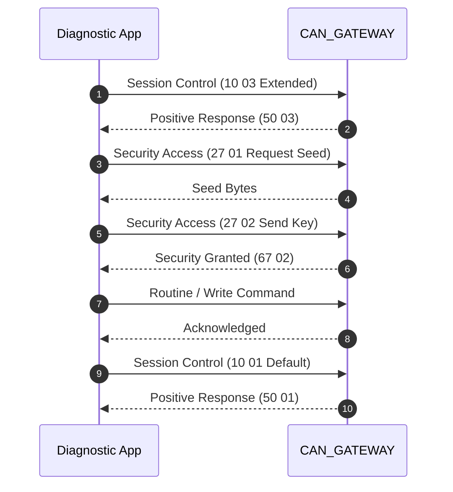

# Service Flow: 12V Battery Registration & Replacement Coding

**Target ECU**: `CAN_GATEWAY (0x19)`  
**Protocol**: `UDS (ISO 14229)`  
**Session**: `Extended Diagnostic Session (0x10 0x03)`  
**Security**: `Login 20103 if required for adaptation`  

## 1. Flow Sequence



## 2. Safety Preconditions

- Ignition ON, Engine OFF
- Battery connected and stable voltage > 12.0V

## 3. Machine-Readable Definition

```json
{
  "tool_id": "TOOL_BATTERY_REG",
  "name": "12V Battery Registration & Replacement Coding",
  "description": "Updates Battery Energy Management (BEM) unit with new battery capacity, chemistry, manufacturer, and serial number to reset charging algorithms.",
  "target_ecu": "CAN_GATEWAY (0x19)",
  "tx_can_id": "0x710",
  "rx_can_id": "0x77A",
  "protocol": "UDS (ISO 14229)",
  "prerequisites": [
    "Ignition ON, Engine OFF",
    "Battery connected and stable voltage > 12.0V"
  ],
  "session": "Extended Diagnostic Session (0x10 0x03)",
  "security": "Login 20103 if required for adaptation",
  "dids": {
    "capacity_ah": "0x2260",
    "technology": "0x2261 (AGM, EFB, GEL, Wet)",
    "manufacturer": "0x2262 (e.g. JCI, VAO, MLA)",
    "serial_number": "0x2263 (10-character string)"
  },
  "write_method": "WriteDataByIdentifier (0x2E)",
  "verification": "Read-back DIDs 0x2260-0x2263 immediately after write",
  "cleanup": "DiagnosticSessionControl Default (0x10 0x01)",
  "evidence_source": "libCarista.so.c line 108420"
}
```
