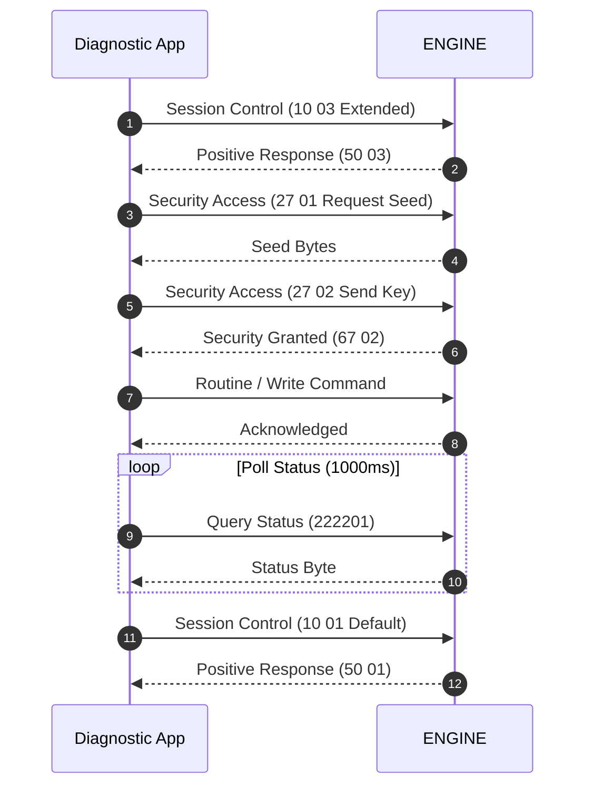

# Service Flow: Diesel Particulate Filter (DPF) Regeneration

**Target ECU**: `ENGINE (0x01)`  
**Protocol**: `UDS (ISO 14229)`  
**Session**: `Extended Diagnostic Session (0x10 0x03)`  
**Security**: `SecurityAccess (0x27 0x01) with Login 27971 or 12233`  

## 1. Flow Sequence



## 2. Safety Preconditions

- Engine running at idle speed (~800 RPM)
- Coolant temperature >= 70 °C
- Fuel tank level >= 25% (quarter tank)
- Transmission in Neutral (manual) or Park (automatic)
- Hood closed, parking brake firmly engaged
- Measured soot mass < 45g (safety limit)

## 3. Machine-Readable Definition

```json
{
  "tool_id": "TOOL_DPF",
  "name": "Diesel Particulate Filter (DPF) Regeneration",
  "description": "Initiates forced soot burn-off procedure for diesel vehicles (stationary service regeneration or emergency driving regeneration).",
  "target_ecu": "ENGINE (0x01)",
  "tx_can_id": "0x7E0",
  "rx_can_id": "0x7E8",
  "protocol": "UDS (ISO 14229)",
  "prerequisites": [
    "Engine running at idle speed (~800 RPM)",
    "Coolant temperature >= 70 \u00b0C",
    "Fuel tank level >= 25% (quarter tank)",
    "Transmission in Neutral (manual) or Park (automatic)",
    "Hood closed, parking brake firmly engaged",
    "Measured soot mass < 45g (safety limit)"
  ],
  "session": "Extended Diagnostic Session (0x10 0x03)",
  "security": "SecurityAccess (0x27 0x01) with Login 27971 or 12233",
  "routines": {
    "stationary_regen": {
      "start_command": "3101053D040000",
      "stop_command": "3102053D",
      "positive_response": "7101053D"
    },
    "driving_regen": {
      "start_command": "31010305040000",
      "stop_command": "31020305",
      "positive_response": "71010305"
    }
  },
  "status_polling": {
    "request_soot": "222201",
    "request_exhaust_temp": "222260",
    "poll_interval_ms": 1000,
    "success_condition": "Soot mass < 5.0 grams"
  },
  "cleanup": "DiagnosticSessionControl Default (0x10 0x01)",
  "evidence_source": "libCarista.so.c line 111143 (VagDpfController)"
}
```
