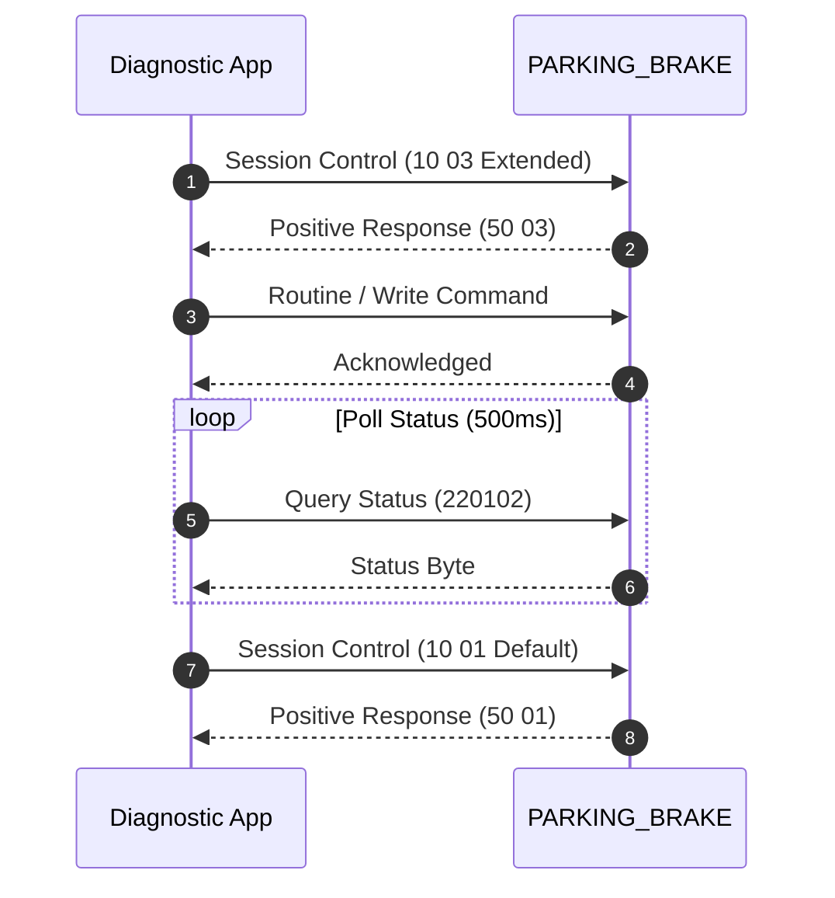

# Service Flow: Electronic Parking Brake (EPB) Service Mode

**Target ECU**: `PARKING_BRAKE (0x53)`  
**Protocol**: `UDS (ISO 14229)`  
**Session**: `Extended Diagnostic Session (0x10 0x03)`  
**Security**: `None required on PQ35/MQB pre-2020; SFD on MQB2020`  

## 1. Flow Sequence



## 2. Safety Preconditions

- Ignition ON, Engine OFF
- Vehicle on level ground with wheel chocks placed
- Parking brake manual switch disengaged (OFF)
- Battery voltage > 12.2V (external charger recommended)

## 3. Machine-Readable Definition

```json
{
  "tool_id": "TOOL_EPB",
  "name": "Electronic Parking Brake (EPB) Service Mode",
  "description": "Retracts rear brake caliper pistons into service position for brake pad replacement, closes them after replacement, and performs automatic pad wear calibration.",
  "target_ecu": "PARKING_BRAKE (0x53)",
  "tx_can_id": "0x752",
  "rx_can_id": "0x7BC",
  "protocol": "UDS (ISO 14229)",
  "prerequisites": [
    "Ignition ON, Engine OFF",
    "Vehicle on level ground with wheel chocks placed",
    "Parking brake manual switch disengaged (OFF)",
    "Battery voltage > 12.2V (external charger recommended)"
  ],
  "session": "Extended Diagnostic Session (0x10 0x03)",
  "security": "None required on PQ35/MQB pre-2020; SFD on MQB2020",
  "routines": {
    "open_calipers": {
      "start_command": "310103A1",
      "stop_command": "310203A1",
      "positive_response": "710103A1"
    },
    "close_calipers": {
      "start_command": "310103A0",
      "stop_command": "310203A0",
      "positive_response": "710103A0"
    },
    "calibrate": {
      "start_command": "310103A2",
      "positive_response": "710103A2"
    }
  },
  "status_polling": {
    "request": "220102",
    "response_prefix": "620102",
    "status_codes": {
      "0x00": "IDLE / NONE",
      "0x10": "SUCCEEDED",
      "0xC0": "IN_PROGRESS",
      "0x40": "FAILED_ABORTED_SAFETY",
      "0x60": "FAILED_CONDITIONS_INCORRECT",
      "0x80": "TIMEOUT"
    },
    "poll_interval_ms": 500,
    "max_timeout_ms": 30000
  },
  "cleanup": "DiagnosticSessionControl Default (0x10 0x01)",
  "evidence_source": "libCarista.so.c line 111280 (VagEpbController)"
}
```
