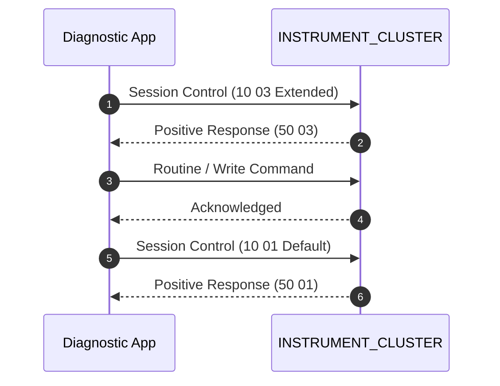

# Service Flow: Service Indicator Reset (Oil & Inspection)

**Target ECU**: `INSTRUMENT_CLUSTER (0x17)`  
**Protocol**: `UDS / KWP2000`  
**Session**: `Extended Diagnostic Session (0x10 0x03)`  
**Security**: `None required`  

## 1. Flow Sequence



## 2. Safety Preconditions

- Ignition ON, Engine OFF

## 3. Machine-Readable Definition

```json
{
  "tool_id": "TOOL_SERVICE_RESET",
  "name": "Service Indicator Reset (Oil & Inspection)",
  "description": "Resets oil service interval and time/distance based inspection warnings in instrument cluster.",
  "target_ecu": "INSTRUMENT_CLUSTER (0x17)",
  "tx_can_id": "0x714",
  "rx_can_id": "0x77E",
  "protocol": "UDS / KWP2000",
  "prerequisites": [
    "Ignition ON, Engine OFF"
  ],
  "session": "Extended Diagnostic Session (0x10 0x03)",
  "security": "None required",
  "methods": {
    "uds_reset": {
      "distance_did": "0x2260 (Distance since service = 0)",
      "days_did": "0x2261 (Time since service = 0)",
      "command": "2E 22 60 00 00"
    },
    "kwp_reset": {
      "channel": "0x02",
      "value": "0x00",
      "command": "3B 02 00"
    }
  },
  "verification": "Read-back returns 0 km / 0 days elapsed",
  "cleanup": "DiagnosticSessionControl Default (0x10 0x01)",
  "evidence_source": "libCarista.so.c line 108460"
}
```
