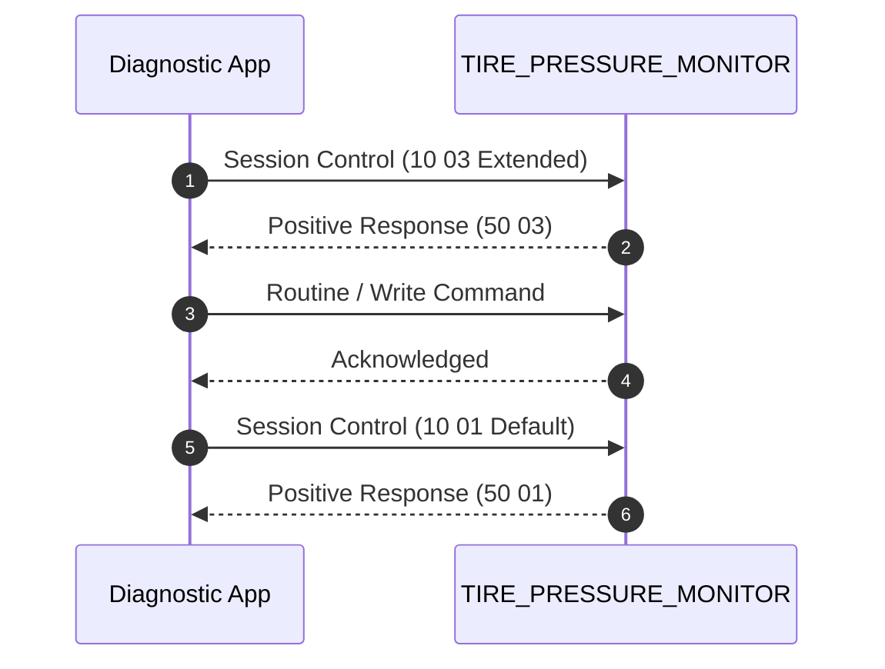

# Service Flow: Tire Pressure Monitoring System (TPMS) Relearn & Calibration

**Target ECU**: `TIRE_PRESSURE_MONITOR (0x65) / ABS (0x03)`  
**Protocol**: `UDS (ISO 14229)`  
**Session**: `Extended Diagnostic Session (0x10 0x03)`  
**Security**: `None`  

## 1. Flow Sequence



## 2. Safety Preconditions

- Tires inflated to recommended cold placard pressure
- Vehicle stationary with ignition ON

## 3. Machine-Readable Definition

```json
{
  "tool_id": "TOOL_TPMS",
  "name": "Tire Pressure Monitoring System (TPMS) Relearn & Calibration",
  "description": "Calibrates wheel speed sensor rolling radius (Indirect TPMS) or registers RF sensor IDs (Direct TPMS).",
  "target_ecu": "TIRE_PRESSURE_MONITOR (0x65) / ABS (0x03)",
  "protocol": "UDS (ISO 14229)",
  "prerequisites": [
    "Tires inflated to recommended cold placard pressure",
    "Vehicle stationary with ignition ON"
  ],
  "session": "Extended Diagnostic Session (0x10 0x03)",
  "security": "None",
  "methods": {
    "indirect_calibration": {
      "ecu": "ABS (0x03)",
      "routine": "0x0400",
      "command": "31010400"
    },
    "direct_id_write": {
      "ecu": "TPMS (0x65)",
      "dids": [
        "0x2240",
        "0x2241",
        "0x2242",
        "0x2243"
      ]
    }
  },
  "verification": "TPMS warning light extinguishes on dash",
  "cleanup": "DiagnosticSessionControl Default (0x10 0x01)",
  "evidence_source": "libCarista.so.c lines 102840-102900"
}
```
