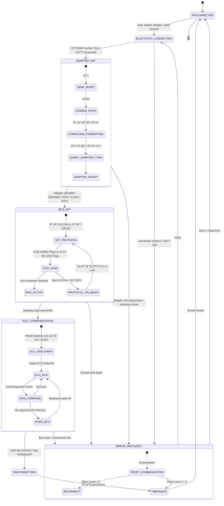

# Transport & Adapter Connection State Machine

## 1. Overview
The connection state machine models the physical and logical link between the Android host application, the OBD adapter microcontroller (ELM327 / STN / vLinker), and the vehicle's CAN bus.

### Evidence
- **Binary**: `libCarista.so`
- **Class**: `ConnectionManager`
- **Methods**: `establishConnection`, `ensureConnection`, `resetConnection`, `hibernateElmChip` (Lines 1347172–1347445)
- **Confidence**: `VERIFIED`

---

## 2. Mermaid State Diagram

---

## 3. State Invariants & Recovery Policies

| State | Timeout | Retry Policy | Fallback Action |
| :--- | :--- | :--- | :--- |
| `BLUETOOTH_CONNECTING` | 10,000 ms | 2 retries | Abort with `BluetoothConnectionFailed` |
| `ADAPTER_INIT` | 2,000 ms per AT command | 3 retries | Reset via DTR/RTS or close socket |
| `BUS_INIT` | 5,000 ms | Cycle protocols: 6 -> 7 -> B | Fallback to ISO 9141 / KWP K-Line |
| `ECU_COMMUNICATION` | P2 (50ms), P2* (5000ms)| 1 retry on NRC 0x78 | Drop session to Default |
| `ERROR_RECOVERY` | 3,000 ms backoff | Max 3 attempts | Call `hibernateElmChip` and disconnect |
