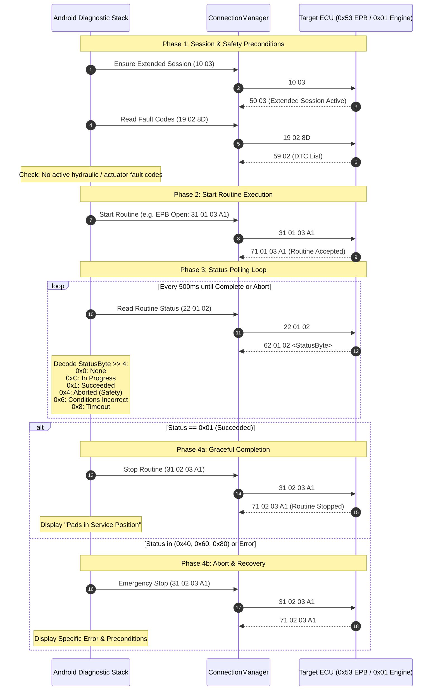

# Service Routine Execution State Machine (EPB / DPF)

## 1. Overview
High-stakes actuator service routines (Electronic Parking Brake pad replacement and DPF regeneration) require strict sequential phase transitions, safety prerequisite checks, and polling loops.

### Evidence
- **Binary**: `libCarista.so`
- **Classes**: `StartVagUdsParkingBrakeOpenCommand`, `StartVagDpfRegenCommand`, `ReadVagUdsStatusCommand`
- **Decompiled C Lines**: 110955–111400
- **Confidence**: `VERIFIED`

---

## 2. Mermaid State Diagram

