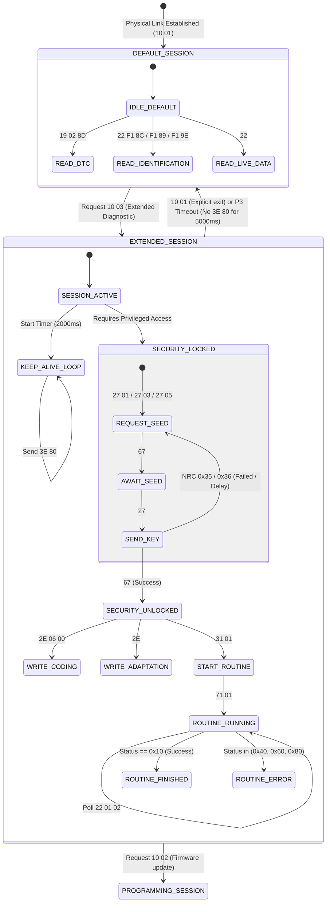

# UDS Diagnostic Session State Machine

## 1. Overview
Models diagnostic session transitions (ISO 14229 Service `0x10`), security access authorization (`0x27`), and tester present keep-alive loops (`0x3E`).

### Evidence
- **Binary**: `libCarista.so`
- **Classes**: `VagUdsEcu`, `TesterPresentCommand`
- **Confidence**: `VERIFIED`

---

## 2. Mermaid State Diagram

---

## 3. Session Keep-Alive Invariants
- When in `EXTENDED_SESSION` (`0x03`), the background dispatcher **must** dispatch `3E 80` every 2,000 ms.
- If an active diagnostic command is currently awaiting a response from the ECU, the TesterPresent packet is deferred until the bus is free.
- On receiving Negative Response Code `0x78` (`requestCorrectlyReceived-ResponsePending`), the P2 timer is extended to `P2*` (5,000 ms).
